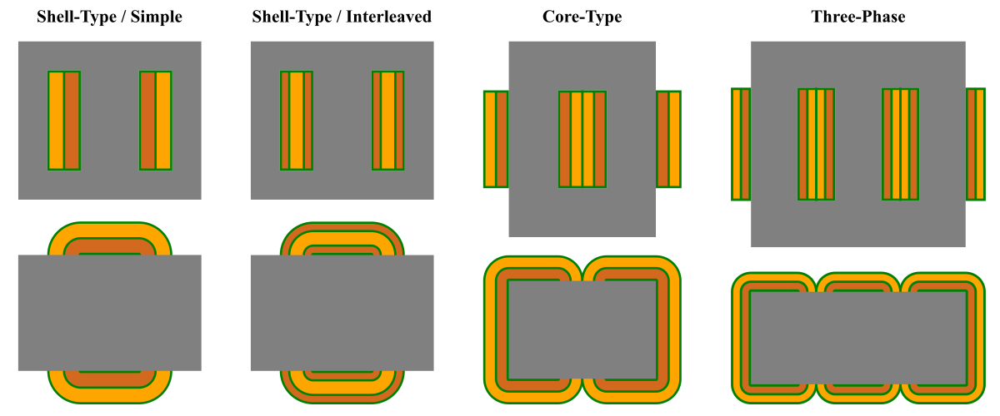
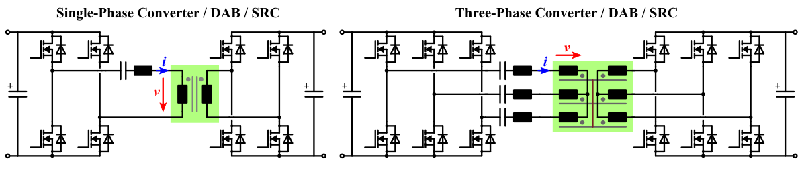
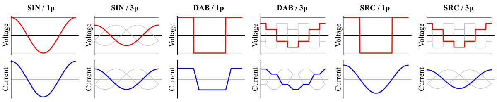

# PyXFMR - Optimization and Scaling of Medium-Frequency Transformers

## Introduction

This repository contains the **source code** related to the following **paper**:
* **Efficiency / Power Density Analysis of Single-Phase and Three-Phase Transformers Employed in DAB and SRC DC/DC Converters**
* **Thomas Guillod, Daifei Zhang, Charles R. Sullivan, and Johann W. Kolar**
* **IEEE ICRERA 2025**

This code implements simple **medium-frequency transformer models**:
* **Shell-type** and **core-type** transformers.
* **Single-phase** and **three-phase** transformers.
* **Delta** and **wye / star** connected transformers.
* Including the **high-frequency core and winding losses**.
* Including the impact of **non-sinusoidal waveforms**.

This code implements several **optimization methods**:
* Analytical optima for the **number of turns** and the **operating frequency**.
* Numerical optima with a **differential evolution solver**.

This code implements several **scaling laws**:
* **Frequency sensitivity** of transformers
* **Winding material scaling laws**
* **Power / volume scaling laws**
* **DAB / SRC** converter comparison.
* **Single-phase / three-phase** comparison.

## Gallery

## Repository Description

* Main Files
  * [paper.pdf](paper.pdf) - PDF of the paper (IEEE copyright)
  * [requirements.txt](requirements.txt) - List of the used Python packages.
  * [param.py](param.py) - Contains the transformer and converter parameters.
* Transformer Optimization
  * [run_design_single.py](run_design_single.py) - Compute a single transformer design.
  * [run_design_analytical.py](run_design_analytical.py) - Compare transformers using analytical optima.
  * [run_design_numerical.py](run_design_numerical.py) - Compare transformers using numerical optima.
* Scaling Laws
  * [run_scaling_freq_sensitivity.py](run_scaling_freq_sensitivity.py) - Transformer frequency sensitivity.
  * [run_scaling_power_volume.py](run_scaling_power_volume.py) - Power rating / power density scaling laws.
  * [run_scaling_winding_type.py](run_scaling_winding_type.py) - Winding material and interleaving scaling laws.
  * [run_scaling_transformer_type.py](run_scaling_transformer_type.py) - Transformer type / converter type scaling laws.
* Transformer Utils
  * [run_utils_steinmetz.py](run_utils_steinmetz.py) - Extract the Steinmetz parameters.
  * [run_utils_waveform.py](run_utils_waveform.py) - Extract the converter waveforms.
  * [run_utils_shape.py](run_utils_shape.py) - Extract the optimal geometrical aspect ratios.
* Python Packages
  * [transformer_scaling](transformer_scaling) - Python package with the transformer models.
  * [transformer_utils](transformer_utils) - Python package with various design tools.
  * [transformer_data](transformer_data) - JSON files with the generated parameters.
  * [transformer_img](transformer_img) - PNG and SVG files for the documentation.

## Compatibility

* Tested on Linux x86/64.
* Tested with Python 3.12.3.
* Package list in `requirements.txt`.

## Author

* Name: **Thomas Guillod**
* Affiliation: Dartmouth College
* Email: guillod@otvam.ch
* Website: https://otvam.ch

## Credits

PyXFMR was created at **Dartmouth College** by the research group of **Prof. Sullivan**:
* Dartmouth College, NH, USA: https://dartmouth.edu
* Dartmouth Engineering: https://engineering.dartmouth.edu

## Copyright

(c) 2025 / Thomas Guillod / Dartmouth College

This Source Code Form is subject to the terms of the Mozilla Public
License, v. 2.0. If a copy of the MPL was not distributed with this
file, You can obtain one at http://mozilla.org/MPL/2.0/.
